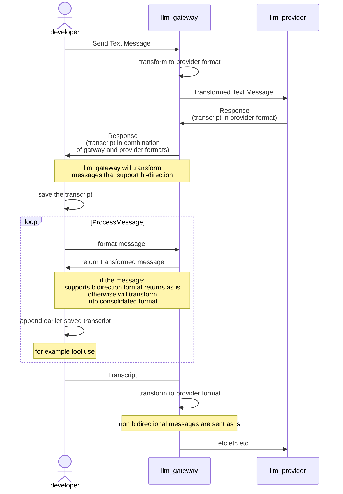

# LlmGateway

Provide a unified translation interface for LLM Provider API's, While allowing developers to have as much control as possible, This does make it more complicated because we dont want developers to be blocked at using something that the provider supports. As time progress the library will mature and support more responses


## Principles:
1. Transcription integrity is most important
2. Input messages must have bidirectional integrity
3. Allow developers as much control as possible

## Assumptions
things that do not support unidirectional format, probably cant be sent between providers

## Mechanics
Messages either support unidirectional or bidirectional format. (unidirectional means we can format it as an output but should not be added as an input).

The result from the llm is in the format that can be sent to the provider, but if you want to consolidate complex messages like code_execution, you must run a mapper we provide manually, but dont send that format back to the provider.

### bidirectional Support
Messages
- Text
- Tool Use
- Tool Response

Tools
- Server Tools
- Tools

### Unidirectional Support
- Server Tool Use Reponse

### Example flow




## Supported Providers
Anthropic, OpenAi, Groq


## Installation

Add the gem to your application's Gemfile:

```bash
bundle add llm_gateway
```

Or install it yourself:

```bash
gem install llm_gateway
```

## Usage

### Basic Chat

```ruby
require 'llm_gateway'

# Simple text completion
LlmGateway::Client.chat(
  'claude-sonnet-4-20250514',
  'What is the capital of France?'
)

# With system message
LlmGateway::Client.chat(
  'gpt-4',
  'What is the capital of France?',
  system: 'You are a helpful geography teacher.'
)

# With inline file
LlmGateway::Client.chat(
  "claude-sonnet-4-20250514",
  [
    {
      role: "user", content: [
        { type: "text", text: "return the content of the document exactly" },
        { type: "file", data: "abc\n", media_type: "text/plain", name: "small.txt"  }
      ]
    },
  ]
)

# Transcript
LlmGateway::Client.chat('llama-3.3-70b-versatile',[
    { role: "user", content: "Tell Me a joke" },
    { role: "assistant", content: "what kind of content"},
    { role: "user", content: "About Sparkling water" },
  ]
)


# Tool usage
LlmGateway::Client.chat('gpt-5',[
    { role: "user", content: "What's the weather in Singapore? reply in 10 words and no special characters" },
    { role: "assistant",
        content: [
          { id: "call_gpXfy9l9QNmShNEbNI1FyuUZ", type: "tool_use", name: "get_weather", input: { location: "Singapore" } }
        ]
    },
    { role: "developer",
      content: [
        { content: "-15 celcius", type: "tool_result", tool_use_id: "call_gpXfy9l9QNmShNEbNI1FyuUZ" }
      ]
    }
  ],
  tools: [ { name: "get_weather", description: "Get current weather for a location", input_schema: { type: "object", properties: { location: { type: "string", description: "City name" } }, required: [ "location" ] } } ]
)
```

### Supported Roles

- user
- developer
- assistant

#### Examples
```ruby
# tool call
{ role: "developer",
  content: [
    { content: "-15 celcius", type: "tool_result", tool_use_id: "call_gpXfy9l9QNmShNEbNI1FyuUZ" }
  ]
}
# plain message
{ role: "user", content: "What's the weather in Singapore? reply in 10 words and no special characters" }

# plain response
{ role: "assistant", content: "what kind of content"},

# tool call response
{ role: "assistant",
    content: [
      { id: "call_gpXfy9l9QNmShNEbNI1FyuUZ", type: "tool_use", name: "get_weather", input: { location: "Singapore" } }
    ]
},
```

developer is an open ai role, but i thought it was usefull for tracing if message sent from server or user so i added
it to the list of roles, when it is not supported it will be mapped to user instead.

you can assume developer and user to be interchangeable


### Files

Many providers offer the ability to upload files which can be referenced in conversations, or for other purposes like batching. Downloading files is also used for when llm generates something or batches complete.

## Examples

```ruby
# Upload File
result = LlmGateway::Client.upload_file("openai", filename: "test.txt", content: "Hello, world!", mime_type: "text/plain")
result = LlmGateway::Client.download_file("openai", file_id: "file-Kb6X7f8YDffu7FG1NcaPVu")
# Response Format
{
  id: "file-Kb6X7f8YDffu7FG1NcaPVu",
  size_bytes: 13,  # follows anthropic naming cause clearer
  created_at: "2025-08-08T06:03:16.000000Z", # follow anthropic style cause easier to read as human
  filename: "test.txt",
  mime_type: nil,
  downloadable: true, # anthropic returns this for other providers it is infered
  expires_at: nil,
  purpose: "user_data" # for anthropic this is always user_data
}
```

### Sample Application

See the [file search bot example](sample/claude_code_clone/) for a complete working application that demonstrates:
- Creating reusable Prompt and Tool classes
- Handling conversation transcripts with tool execution
- Building an interactive terminal interface

To run the sample:

```bash
cd sample/claude_code_clone
ruby run.rb
```

The bot will prompt for your model and API key, then allow you to ask natural language questions about finding files and searching directories.

### Response Format

All providers return responses in a consistent format:

```ruby
{
  choices: [
    {
      content: [
        { type: 'text', text: 'The capital of France is Paris.' }
      ],
      finish_reason: 'end_turn',
      role: 'assistant'
    }
  ],
  usage: {
    input_tokens: 15,
    output_tokens: 8,
    total_tokens: 23
  },
  model: 'claude-sonnet-4-20250514',
  id: 'msg_abc123'
}
```

### Error Handling

LlmGateway provides consistent error handling across all providers:

```ruby
begin
  result = LlmGateway::Client.chat('invalid-model', 'Hello')
rescue LlmGateway::Errors::UnsupportedModel => e
  puts "Unsupported model: #{e.message}"
rescue LlmGateway::Errors::AuthenticationError => e
  puts "Authentication failed: #{e.message}"
rescue LlmGateway::Errors::RateLimitError => e
  puts "Rate limit exceeded: #{e.message}"
end
```

## Development

After checking out the repo, run `bin/setup` to install dependencies. Then, run `rake test` to run the tests. You can also run `bin/console` for an interactive prompt that will allow you to experiment.

To install this gem onto your local machine, run `bundle exec rake install`. To release a new version, update the version number in `version.rb`, and then run `bundle exec rake release`, which will create a git tag for the version, push git commits and the created tag, and push the `.gem` file to [rubygems.org](https://rubygems.org).

## Contributing

Bug reports and pull requests are welcome on GitHub at https://github.com/Hyper-Unearthing/llm_gateway. This project is intended to be a safe, welcoming space for collaboration, and contributors are expected to adhere to the [code of conduct](https://github.com/Hyper-Unearthing/llm_gateway/blob/master/CODE_OF_CONDUCT.md).

## License

The gem is available as open source under the terms of the [MIT License](https://opensource.org/licenses/MIT).

## Code of Conduct

Everyone interacting in the LlmGateway project's codebases, issue trackers, chat rooms and mailing lists is expected to follow the [code of conduct](https://github.com/Hyper-Unearthing/llm_gateway/blob/master/CODE_OF_CONDUCT.md).
